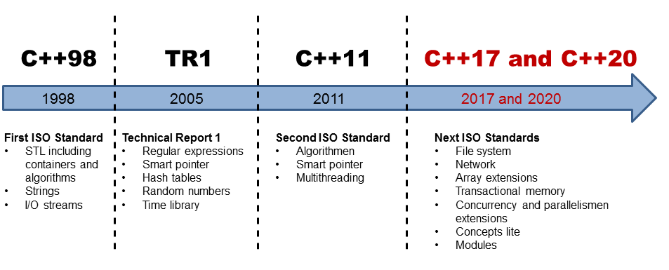

# Historia (breve) de C++

En 1970, **Dennis Ritchie**, crea el lenguaje C en los laboratorios Bell (AT&T).

En 1998, **Bjarne Stroustrup**, también empleado de laboratorios Bell, crea el
lenguaje C++ (originalmente llamado "_C con clases_"), como una mejora de C,
añadiendo soporte para la _Programación Orientada a Objetos_ (POO).

> Los signos `++` son un operador de incremento en C.
> De ahí el nombre C++ (incremento de C)

Al ser un lenguaje "_pariente_" de C, todo programa escrito en C es válido
también en C++.

> Nota geek: Debido a su capacidad de procesamiento y facilidad de uso, C y C++
> fueron utilizados en la creación de los efectos especiales de las primeras
> películas de Star Wars. 

### Evolución de C++ en el tiempo

